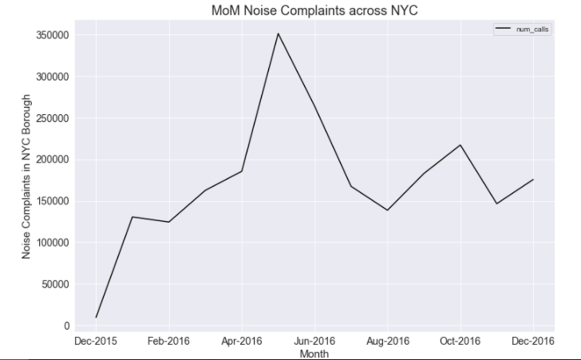
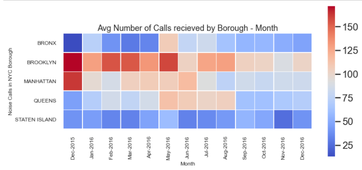
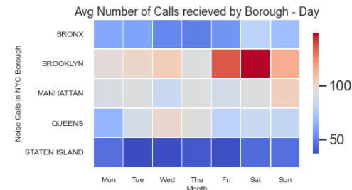
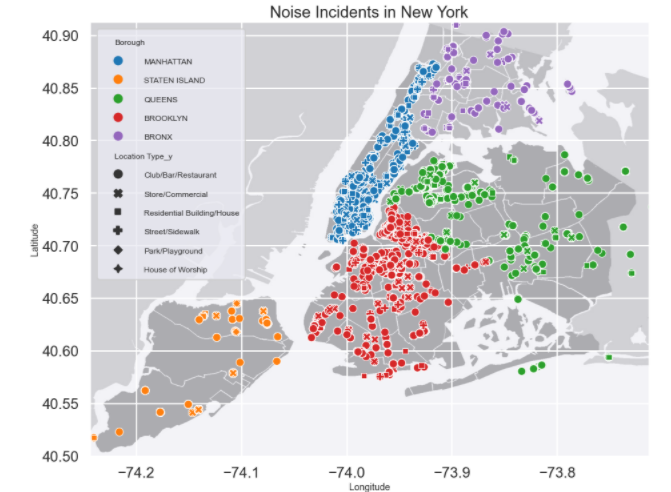
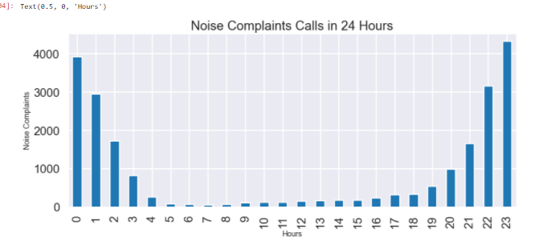
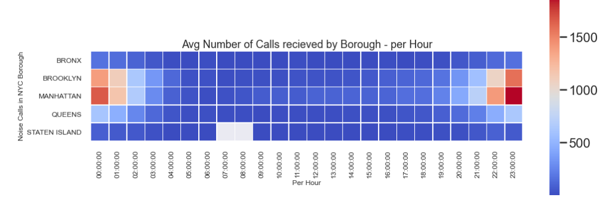
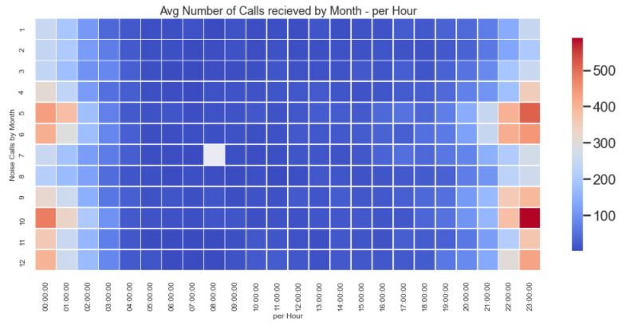

# NYC Noise Complaints 2016: Data Analysis Project
This project focuses on Noise complaints that were collected in 2016 and indicate ongoing party in a given neighborhood. I will be carrying out an explanatory analysis on NYC complaint data set from December 2015 to December 2016. The aim of the analysis is not only to understand the data set better but also answer some of the key questions that will help he community to find the patterns in the data that will lead to better solutions.

1 - Load the data on to Python and clean the data

2 - Carried out EDA on Noise Complaints and finding key pattern to help the community.

3 - Created a Dashboard inside Tableau that allows users to explore noise complaints across NYC.

# Code and Resources Used

**Python Version**: 3.7

**Packages**: pandas, numpy, matplotlib, seaborn,json

**Kaggle**: https://www.kaggle.com/somesnm/partynyc

# [2. Data Cleaning](https://github.com/Jaspreetsm21/Yelp_Restaurants_Reviews_Analysis/blob/master/Data%20Cleaning.ipynb)

After downloading the data, I needed to clean it up so that it was usable for our analysis. 

- Changing the Created Date column to date type and adding new columns Year,Month and Day. 

# [3. EDA](https://github.com/Jaspreetsm21/Yelp_Restaurants_Reviews_Analysis/blob/master/EDA.ipynb)

# Insight
- Noise Complaints peaks around festivals, we can clearly see a seasonal pattern from New Year, Easter, Halloween and Christmas.
- On Average Bronx received fewer noise calls in all of the 5 Borough. Whereas Brooklyn/Manhattan received twice as many calls than Bronx. 
- On Weekend there more calls received, this could be due to more people going out.
- Brooklyn/Manhattan has 8 to 9 times more Club/Bar/Restaurant than Bronx(& Staten Island).Which mean there could be a correlation between more places more noise complaints.
- Increasing Police present across Manhattan and Brooklyn around festivals will decrease the peak noise complaints.
-  In Brooklyn there are only 18 Zip code that had more than 100 noise and in Manhattan there are 19 Zip code. Having more Police present in these area could help to reduce noise complaints.
-  Majority of the noise complaints occur between 10pm and 2am - especially in Brooklyn and Manhattan

